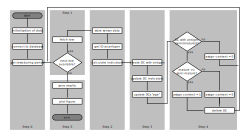

# RPi Sink Node Analysis Software #

In the following, information on the preparations, prerequisites and the setup of the Raspberry Pi-based sink node analysis software can be found.
This software, or more specifically Python script, implements the centralized dendritic cell algorithm (DCA) to detect possibly distorted sensor values as a result of sensor node faults.
It calculated an anomaly coefficient for each sensor node during a time windows of pre-defined width (time).

## Prerequisites ##

* Make sure you have Python 3 and the required packeges (i.e., `pip` and `libmysqlclient`) installed:  
    `sudo apt install python3-dev python3-pip default-libmysqlclient-dev`
* The following Python modules are required by the script:
    * **MySQL Connector**:
        * Python needs a MySQL driver to access the remote MySQL database.
        * In the provided scripts, the [`mysql-connector`](https://dev.mysql.com/doc/connector-python/en/connector-python-installation-binary.html) module is used:  
            `python3 -m pip install mysql-connector-python`
    * **Mathplotlib**:  
            `sudo apt install python3-tk libatlas-base-dev libopenjp2-7-dev`  
            `python3 -m pip install matplotlib numpy scipy`

## Entity Mapping ##

As stated by many researchers working with artificial immune systems (AIS), one of the most important but also most difficult aspects is the mapping of computing systems, components, or data to the corresponding biological entities of the mammal/human immune system.

In our centralized DCA implementation, the sensor nodes' will act as a from of virtual tissue while the sink node performs the actions of a virtual thymus.
Thereby, the following mapping is used:

* **Antigens**: antigens refer to the entities/circumstances/etc. that need to be classified as either normal or anomalous; in our case, the classification refers to the proper operation of the sensor nodes and, thus, we use the sensor node's ID (lower 32-bit of the XBee MAC address) as antigens.
* **PAMP**: the pathogen associated molecular pattern (PAMP) indicate a clear evidence of danger; in our case we use the reset source indicator X_RST as a node reset should not happen in regular operation and, thus, is a clear sign of dangerous circumstances.
* **Danger**: the danger indicators express circumstances that are dangerous to the proper operation; we use our fault indicators as danger indicators where the final value is calculated as a weighted sum of the single indicators.
* **Safe**: the safe indicator represents circumstances that show regular ("safe") operation; we use the sum of differences between the last sensor measurements and the current sensor update as safe indicator where a smaller difference results in a larger "safeness".
* **IC**: the inflammatory cytokines (IC) indicate an already ongoing inflammation and accelerate the maturation of cells; currently, we do not use ICs in our setup. For future extensions, an already detected faulty sensor node (e.g., by a other/superior fault detection scheme) could be used as IC.
* **Time windows**: we perform an online detection in a time-windowed manner. That is, there are always N dendritic cells active that have a lifespan of N iterations. In each iteration, one cell maturates (and "dies") while a new cell is born. Doing so, we get one cell with (semi)matured status every iteration that can be used to assign the context (normal/anomalous) to the latest sensor value update.

## Program Execution ##

The sink node analysis software (i.e., Python script) is divided in four main steps (aside from the necessary initialization):

0. (Initialization of data structures)
1. Acquire latest sensor node update information (e.g., sensor values plus fault indicators)
2. Get the antigen value and calculate the PAMP, danger, and safe indicator values
3. Update the dendritic cell values according to the DCA
4. Assign the resulting context (0 .. normal / 1 .. anomalous) of the currently maturating cell to the latest sensor values

The general flow of program execution is as follows:  

